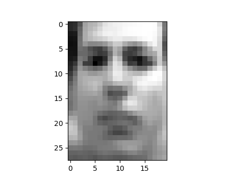

<h1 align="center">
  <br>
  <a href="https://jotrockenmitlocken.de"></a>
  <br>
    MLPlayground
  <br>
  <br>
  <a href="https://jotrockenmitlocken.de"></a>
  <a href="https://jotrockenmitlocken.de"></a>
  <a href="https://jotrockenmitlocken.de"></a>
  <a href="https://jotrockenmitlocken.de"></a>
  <br>
</h1>

[](https://jotrockenmitlocken.de)
[](https://jotrockenmitlocken.de)
[](https://jotrockenmitlocken.de)
[](https://codecov.io/gh/Kataglyphis/MachineLearningAlgorithms)
[](https://www.paypal.com/donate/?hosted_button_id=BX9AVVES2P9LN)
[](https://twitter.com/Cataglyphis_)
[](https://www.youtube.com/channel/UC3LZiH4sZzzaVBCUV8knYeg)

<h4 align="center"> Playground for various ML algorithms <a href="https://jotrockenmitlocken.de/" target="_blank"></a>.</h4>

<!-- <p align="center">
  <a href="https://paypal.me/JonasHeinle?locale.x=de_DE">
    
  </a>
</p> -->

<p align="center">
  <a href="#key-features">Key Features</a> •
  <a href="#how-to-use">How To Use</a> •
  <a href="#download">Download</a> •
  <a href="#related">Related</a> •
  <a href="#license">License</a> •
  <a href="#literature">Literature</a>
</p>

<!-- TABLE OF CONTENTS -->
<details open="open">
  <summary>Table of Contents</summary>
  <ol>
    <li>
      <a href="#about-the-project">About The Project</a>
      <ul>
        <li><a href="#built-with">Built With</a></li>
      </ul>
      <ul>
        <li><a href="#key-features">Key Features</a></li>
      </ul>
    </li>
    <li>
      <a href="#getting-started">Getting Started</a>
      <ul>
        <li><a href="#prerequisites">Prerequisites</a></li>
        <li><a href="#installation">Installation</a></li>
      </ul>
    </li>
    <li>
      <a href="#roadmap">Usage</a></li>
      <ul>
        <li><a href="#environment">pip/conda environment</a></li>
        <li><a href="#vae">VAE</a></li>
        <li><a href="#image segmentation">Image Segmentation</a></li>
      </ul>
    <li>
      <a href="#roadmap">Tests</a></li>
      <ul>
        <li><a href="#environment">Code Coverage</a></li>
      </ul>
    <li><a href="#contributing">Contributing</a></li>
    <li><a href="#license">License</a></li>
    <li><a href="#contact">Contact</a></li>
    <li><a href="#literature">Literature</a></li>
  </ol>
</details>

<!-- ABOUT THE PROJECT -->
## About The Project

Playground for a variety of different ML algorithms

### Key Features

<!-- ❌ -->
|          Feature                                      |   Implement Status | 
| --------------------------------                      | :----------------: | 
| VAE                                                   |         ✔️         |
| LSTM                                                  |         ✔️         |
| Image Segmentation with U-Net                         |         ✔️         |
| Object Detection                                      |         ✔️         |
| Face similarity measure                               |         ✔️         |
| Linear Regression                                     |         ✔️         |
| Linear Classification                                 |         ✔️         |
| Naive Bayes Classifier                                |         ✔️         |
| Multiclass Classification                             |         ✔️         |
| k-NN                                                  |         ✔️         |
| Forests                                               |         ✔️         |
| Kernel Ridge Regression                               |         ✔️         |
| Kernelized Support Vector Machine                     |         ✔️         |
| Bayesian Linear Regression                            |         ✔️         |
| Gaussian Processes                                    |         ✔️         |
| k-Means                                               |         ✔️         |
| Expectation Maximization for Gaussian Mixture Models  |         ✔️         |
| Probabilistic PCA with Expectation Maximization       |         ✔️         |
| Neural Network Classifier from Scratch                |         ✔️         |
| Probabilistic PCA with Expectation Maximization       |         ✔️         |
### Built With

* [Python](https://www.python.org/)
* [Jupyter Notebook](https://jupyter.org/)
* [CuPy](https://cupy.dev/)
* [Cuda](https://developer.nvidia.com/cuda-zone)
* [TensorFlow](https://www.tensorflow.org/)
* [Anaconda](https://www.anaconda.com/products/distribution)
* [pytest](https://docs.pytest.org/en/7.1.x/getting-started.html#get-started)
* [Github Actions: setup-miniconda](https://github.com/marketplace/actions/setup-miniconda)
<!-- GETTING STARTED -->
## Getting Started

### Prerequisites

[Python](https://www.python.org/) 3.9 <br />
For the dependencies on python modules I created a [Anaconda Env .yml](Documents/anaconda/environment.yaml). You can import it in your anaconda project.<br />
Some graphics card. 


### Installation

1. Clone the repo

   ```sh
   git clone git@github.com:Kataglyphis/MachineLearningAlgorithms.git
   ```
2. Consider using some form of packet management/-distribution software. I am using here [Anaconda](https://www.anaconda.com/products/distribution). If you also do so you can use my [Anaconda Env .yml](Documents/anaconda/environment.yaml) for getting all python module dependencies.

<!-- USAGE EXAMPLES -->
## Usage

### pip/conda environment

I use this command to generate cross-platform env.yaml files.
```sh
    conda env export --from-history>environment.yaml
   ```

see also: [Anaconda entry on environments](https://docs.conda.io/projects/conda/en/latest/user-guide/tasks/manage-environments.html#sharing-an-environment).

### VAE

```sh
    # for training VAE
    python train_vae.py train
    # checking the gradients
    python train_vae.py gradcheck
    #generating sample
    python train_vae.py sample
   ```

<h1 align="center">
  <br>
  <a href="https://jotrockenmitlocken.de"></a>
  <br>
</h1>

### LSTM 


```sh
    # for training VAE
    python lstm_cupy.py train
    # checking the gradients
    python lstm_cupy.py gradcheck
    #generating sample
    python lstm_cupy.py sample sample
```

---
**NOTE**
Under folder "data/" one can place any kind of .txt file one want to train the net with.
Just make sure it is a .txt!
---

```
From Kants critique of practical reason I got sentences like:

(emb_size = 16
hidden_size = 124
seq_length = 512
learning_rate = 5e-2 
max_updates = 500000
batch_size = 32)

1.Result:
"on this it thush that determinated and representakoug advantaresuct
form) usefing
on which there dayver in this made of us as all in our cases of a rat just on it were orle freptive the law is of it. Thus to formalore this serucion the vatures,
the conding our explesed the vater, he constadnes and only a necessare the hedution now thisk the conduapo-sted anduredsifinated are
lastingavt one of thisplyssul supposables outisaty his
oblige of us. Forble only a have feeling to it it itself vione in it were is can in it were in this
doublious merew, justifysero anderedores in our vabutualy as a new this
condualed as alwagation as a
categ- will gerery give
us
all the fationed as all caneon constanally a universal empithed for such it it be advantaking on it whrows for
not of in this
sured, or beings have or private it it it tho advinated in a noursinedmegules determinour now on it. Thus, fromnevery or in a prove of thishity or if and it of a raterfined to formare of this deterd no douneablentonedered it come is a higher deterd of this dul to high. Now
its conduaventi;ethul frequently screp; this
suterninamersthicatedmentare the om its oblinately is a higherw
somethicated as alwaysion firmtom constionchilesogich is in this
dodevere
composenery
thind the bas ratherw
hablog constioning virtuest trued it out to
formapo,
advant well of and chereng in its or if thishs in our causaly his
erred oursualing the
ablegt of would only a universul the formais or segve
frounds thishigances the vatherw
the bat the determination of to its or in it because the caterfinateorangionation with things the deduct
of morality this dod alonestimateneables, notions our ear
of it a had of us a had only only a law with the
bein the in
happly to finds to
acu thereon whiculain he can physist to this dut all the vated, however, of it it destricest, and man's onowledgringuit is nothing
an every us to fog mo,ing on its own adept only a reasonally andering the
tysted a universublestlying the bound fromnes"  

```

### Image Segmentation

There is a high demand in image segmentation applications.
With this project you get access to a tool enabling you to build such.

<h1 align="center">
  <br>
  <a href="https://jotrockenmitlocken.de"></a>
  <br>
</h1>

### Object Detection

### Face similarity measure

## Tests

### Code Coverage
* [Watch test results here](Documents/googletest/test_detail.xml)
<h3>Code coverage results</h3>
<h1 align="center">
  <a href="https://jotrockenmitlocken.de"></a>
  <a href="https://jotrockenmitlocken.de"></a>
</h1>

<!-- CONTRIBUTING -->
## Contributing

Contributions are what make the open source community such an amazing place to be learn, inspire, and create. Any contributions you make are **greatly appreciated**.

1. Fork the Project
2. Create your Feature Branch (`git checkout -b feature/AmazingFeature`)
3. Commit your Changes (`git commit -m 'Add some AmazingFeature'`)
4. Push to the Branch (`git push origin feature/AmazingFeature`)
5. Open a Pull Request

<!-- LICENSE -->
## License

Distributed under the GPL-3.0 License. See `LICENSE` for more information.

<!-- CONTACT -->
## Contact

Jonas Heinle - [@Cataglyphis_](https://twitter.com/Cataglyphis_) - jonasheinle@googlemail.com

Project Link: [https://github.com/Kataglyphis/MachineLearningAlgorithms](https://github.com/Kataglyphis/MachineLearningAlgorithms)

## Literature 
Anaconda
* [cheatsheet](https://docs.conda.io/projects/conda/en/latest/_downloads/843d9e0198f2a193a3484886fa28163c/conda-cheatsheet.pdf)
Machine Learning Literature
* [The Matrix Cookbook](https://www.math.uwaterloo.ca/~hwolkowi/matrixcookbook.pdf)

Datasets
* [pytorch datasets](https://github.com/pytorch/vision)

VAE
* [Diederik P Kingma and Max Welling. 2013. Autoencoding variational bayes](https://arxiv.org/abs/1312.6114)
* [quanpn90](https://github.com/quanpn90/VAEAssignment-DLNN2020)

LSTM 
* [karpathy](https://github.com/karpathy/char-rnn)
* [quanpn90](https://github.com/quanpn90/LSTMAssignment-DLNN2020)

RNN
* [karpathy](http://karpathy.github.io/2015/05/21/rnn-effectiveness/)

Image Segmentation
* [U-Net](https://lmb.informatik.uni-freiburg.de/people/ronneber/u-net/)

<!-- MARKDOWN LINKS & IMAGES -->
<!-- https://www.markdownguide.org/basic-syntax/#reference-style-links -->
[contributors-shield]: https://img.shields.io/github/contributors/othneildrew/Best-README-Template.svg?style=for-the-badge
[contributors-url]: https://github.com/othneildrew/Best-README-Template/graphs/contributors
[forks-shield]: https://img.shields.io/github/forks/othneildrew/Best-README-Template.svg?style=for-the-badge
[forks-url]: https://github.com/othneildrew/Best-README-Template/network/members
[stars-shield]: https://img.shields.io/github/stars/othneildrew/Best-README-Template.svg?style=for-the-badge
[stars-url]: https://github.com/othneildrew/Best-README-Template/stargazers
[issues-shield]: https://img.shields.io/github/issues/othneildrew/Best-README-Template.svg?style=for-the-badge
[issues-url]: https://github.com/othneildrew/Best-README-Template/issues
[license-shield]: https://img.shields.io/github/license/othneildrew/Best-README-Template.svg?style=for-the-badge
[license-url]: https://github.com/othneildrew/Best-README-Template/blob/master/LICENSE.txt
[linkedin-shield]: https://img.shields.io/badge/-LinkedIn-black.svg?style=for-the-badge&logo=linkedin&colorB=555
[linkedin-url]: https://www.linkedin.com/in/jonas-heinle-0b2a301a0/
